# `@ljoukov/sheet` [](https://www.npmjs.com/package/@ljoukov/sheet) [](https://www.npmjs.com/package/@ljoukov/sheet) [](https://github.com/ljoukov/sheet/actions/workflows/ci.yml) [](./LICENSE) [](https://sheet.ljoukov.workers.dev/)

Paper-first Svelte components for rendering printable-style worksheets, reviewed answer sheets, rich tutor feedback cards, and reply threads.

Live gallery: [sheet.ljoukov.workers.dev](https://sheet.ljoukov.workers.dev/)

## What It Includes

- `Sheet`: full worksheet renderer with interactive, readonly, review, and demo modes
- `SheetFeedbackCard`: question-level review note with optional reply flow
- `SheetFeedbackThread`: standalone tutor thread and composer surface
- `Markdown`: shared markdown renderer with KaTeX maths and syntax highlighting
- built-in question layouts for fill-in, multiple choice, lines, calculation, matching, and spelling prompts
- typed schemas, exported types, and seeded sample documents for local demos

## Install

```sh
npm install @ljoukov/sheet
```

Import the package stylesheet once so KaTeX and shared utility styles are available:

```svelte
<script lang="ts">
	import '@ljoukov/sheet/styles.css';
</script>
```

## Quick Start

```svelte
<script lang="ts">
	import '@ljoukov/sheet/styles.css';
	import { Sheet, sampleSheets, type SheetAnswers } from '@ljoukov/sheet';

	const sample = sampleSheets[0];
	let answers: SheetAnswers = sample.seedAnswers ?? {};
</script>

<Sheet document={sample.document} mode="demo" mockReview={sample.mockReview} bind:answers />
```

For live tutoring flows, pass `review`, `feedbackThreads`, `feedbackState`, and `onReply` into `Sheet`, or use `SheetFeedbackCard` and `SheetFeedbackThread` directly when you need those surfaces outside the full worksheet layout.

## Surface Catalog

The sections below show the exported components and built-in `Sheet` surfaces, with the implementation file, what each surface is for, and the inputs it expects.

### Sheet

Implements: [`Sheet`](src/lib/Sheet.svelte)

Description: Top-level worksheet surface with theme tokens, header, optional grading summary, hook/content sections, answer state, and optional tutor feedback.

Required inputs

- `document`
- `document.id`
- `document.subject`
- `document.level`
- `document.title`
- `document.subtitle`
- `document.color`
- `document.accent`
- `document.light`
- `document.border`
- `document.sections[]`

Optional inputs

- `answers`
- `seedAnswers`
- `review`
- `mockReview`
- `feedbackThreads`
- `feedbackState`
- `mode`
- `allowReplies`
- `showFooter`
- `footerLabel`
- `onAnswersChange`
- `onReply`

<p>
  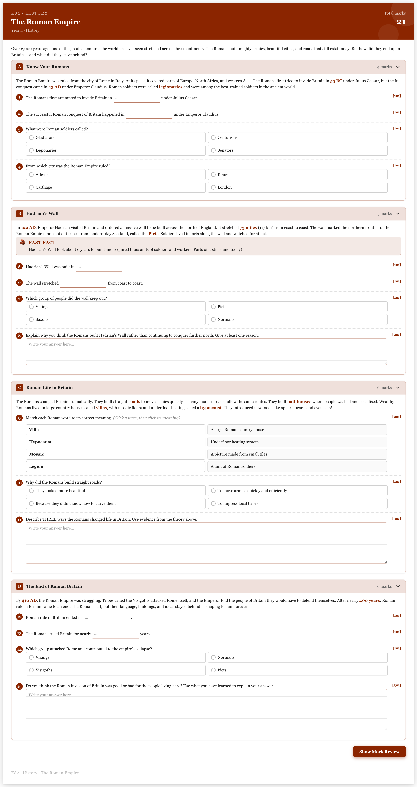
  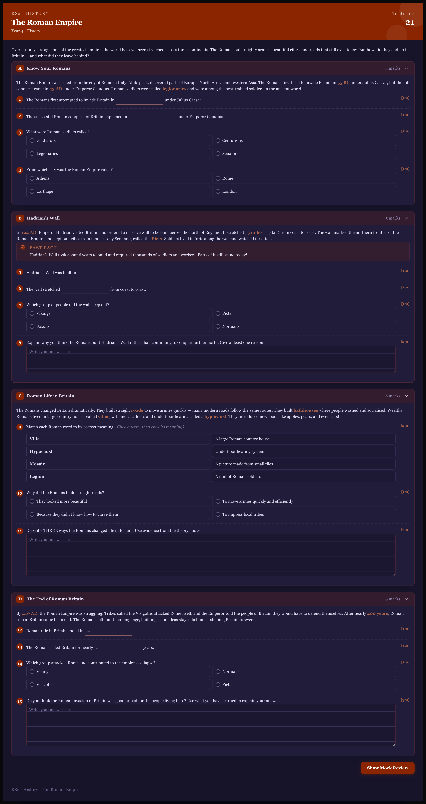
</p>

### Grading summary

Rendered by [`Sheet`](src/lib/Sheet.svelte), implementation in [`src/lib/components/sheet/paper-sheet.svelte`](src/lib/components/sheet/paper-sheet.svelte)

Description: Top-level review banner that communicates score, grading note, and whether some marks remain in teacher review.

Required inputs

- `review.score.got`
- `review.score.total`
- `review.label`
- `review.message`
- `review.note`
- `review.questions`

Optional inputs

- `review.objectiveQuestionCount`
- `review.teacherReviewMarks`
- `review.teacherReviewQuestionCount`

Shown near the top of `Sheet` when `review` or `mockReview` is provided.

<p>
  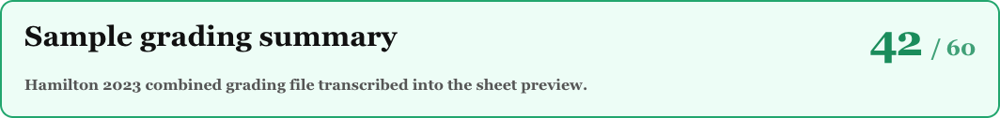
</p>
<p>
  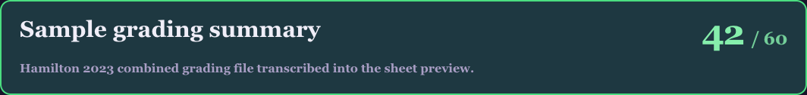
</p>

### Feedback card

Implements: [`SheetFeedbackCard`](src/lib/SheetFeedbackCard.svelte)

Description: Per-question feedback surface that wraps a review note, optional conversation thread, and reply composer.

Required inputs

- `review`

Optional inputs

- `open`
- `draft`
- `thread`
- `processing`
- `runtimeStatus`
- `thinkingText`
- `assistantDraftText`
- `showComposer`
- `showFollowUpButton`
- `resolvedFollowUpMode`
- `draftAttachments`
- `draftAttachmentError`
- `allowAttachments`
- `allowTakePhoto`
- `questionLabel`
- `onToggle`
- `onRequestFollowUp`
- `onAttachFiles`
- `onRemoveDraftAttachment`
- `onDraftChange`
- `onReply`

<p>
  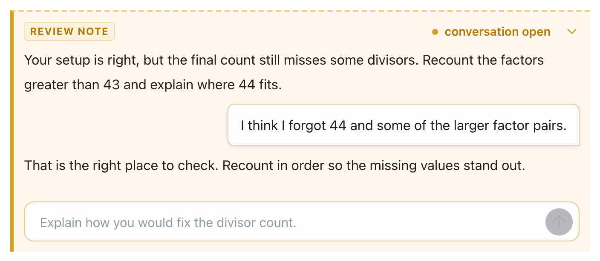
</p>
<p>
  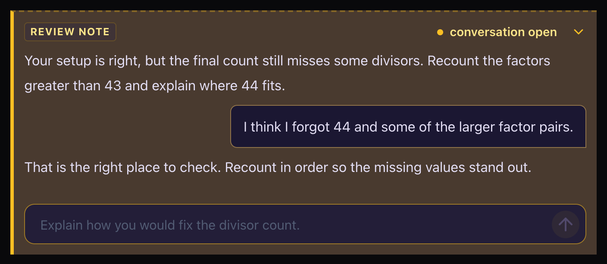
</p>

### Feedback thread

Implements: [`SheetFeedbackThread`](src/lib/SheetFeedbackThread.svelte)

Description: Standalone tutor conversation and composer surface for embedding a feedback thread outside the full worksheet layout.

Required inputs

- none

Optional inputs

- `thread`
- `draft`
- `processing`
- `runtimeStatus`
- `thinkingText`
- `assistantDraftText`
- `showComposer`
- `showFollowUpButton`
- `resolvedFollowUpMode`
- `draftAttachments`
- `draftAttachmentError`
- `allowAttachments`
- `allowTakePhoto`
- `placeholder`
- `questionLabel`
- `onRequestFollowUp`
- `onAttachFiles`
- `onRemoveDraftAttachment`
- `onDraftChange`
- `onReply`

<p>
  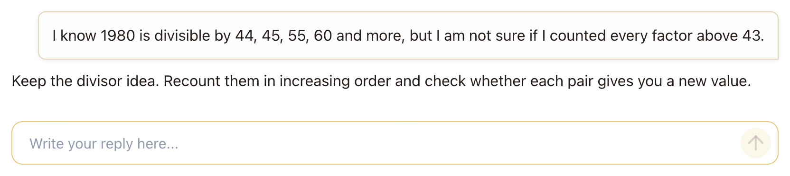
</p>
<p>
  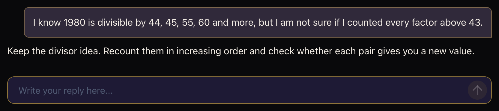
</p>

### Markdown

Implements: [`Markdown`](src/lib/components/markdown/markdown-content.svelte)

Description: Shared Markdown renderer with KaTeX maths, syntax-highlighted code blocks, inline rendering, and copy buttons for fenced code.

Required inputs

- `markdown`

Optional inputs

- `inline`
- `class`

<p>
  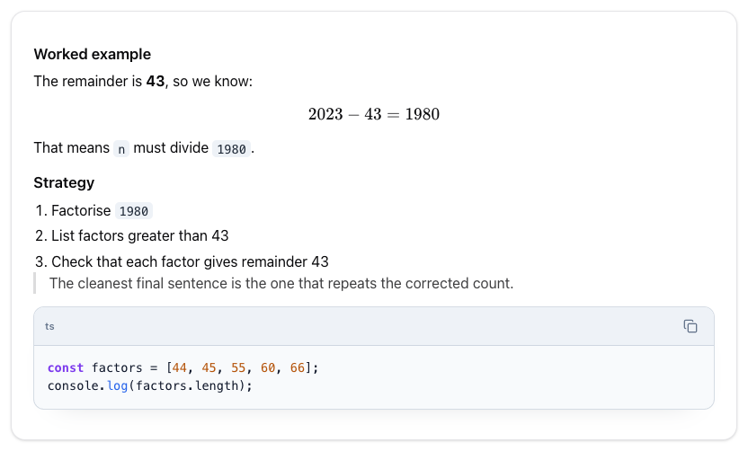
</p>
<p>
  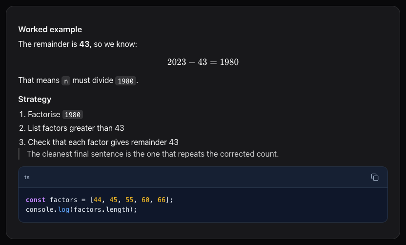
</p>

### Fill in the blanks

Rendered by [`Sheet`](src/lib/Sheet.svelte), question layout in [`src/lib/components/sheet/paper-sheet.svelte`](src/lib/components/sheet/paper-sheet.svelte)

Description: Inline sentence-completion row with one or two blank fields for short factual recall and keyword retrieval.

Required inputs

- `question.id`
- `question.type = "fill"`
- `question.marks`
- `question.prompt`
- `question.blanks[]`
- `question.after`

Optional inputs

- `question.conjunction`
- `blank.placeholder`
- `blank.minWidth`

Answer payload: `answers[question.id] = Record<"0" | "1", string>`

<p>
  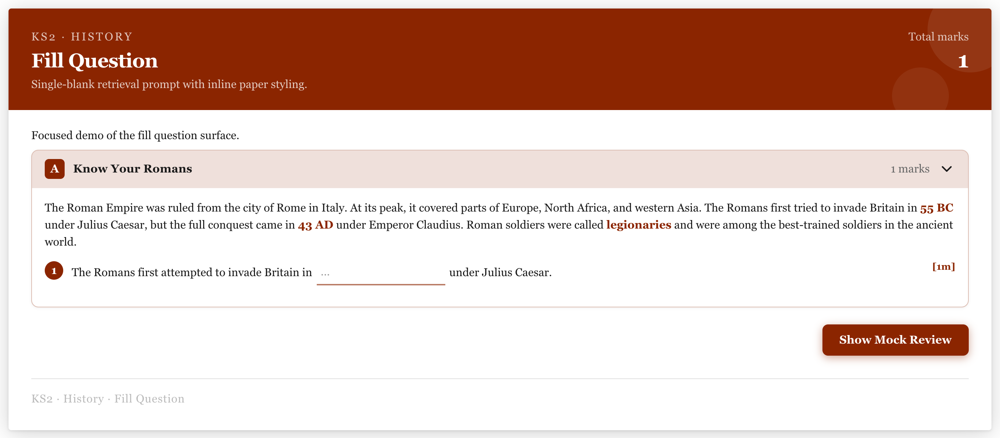
</p>
<p>
  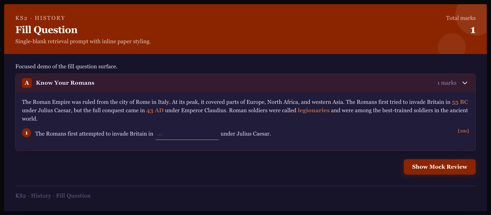
</p>

### Multiple choice

Rendered by [`Sheet`](src/lib/Sheet.svelte), question layout in [`src/lib/components/sheet/paper-sheet.svelte`](src/lib/components/sheet/paper-sheet.svelte)

Description: Single-select question row with two or more markdown-capable options.

Required inputs

- `question.id`
- `question.type = "mcq"`
- `question.marks`
- `question.prompt`
- `question.options[]`

Optional inputs

- none

Answer payload: `answers[question.id] = string`

<p>
  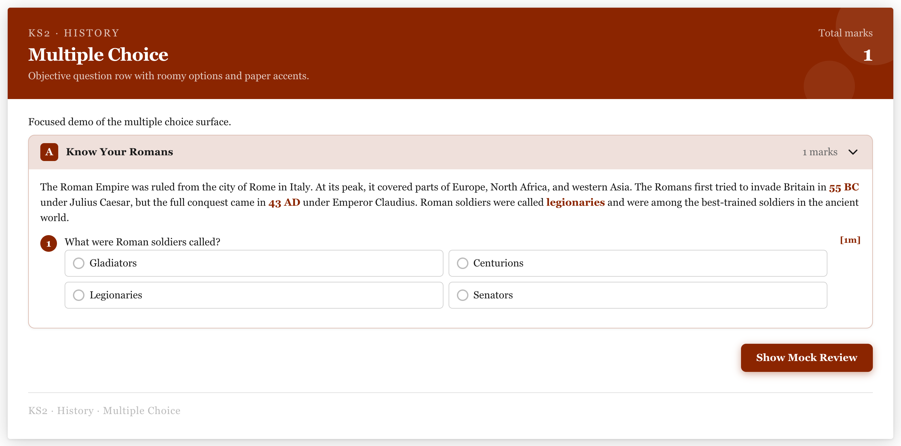
</p>
<p>
  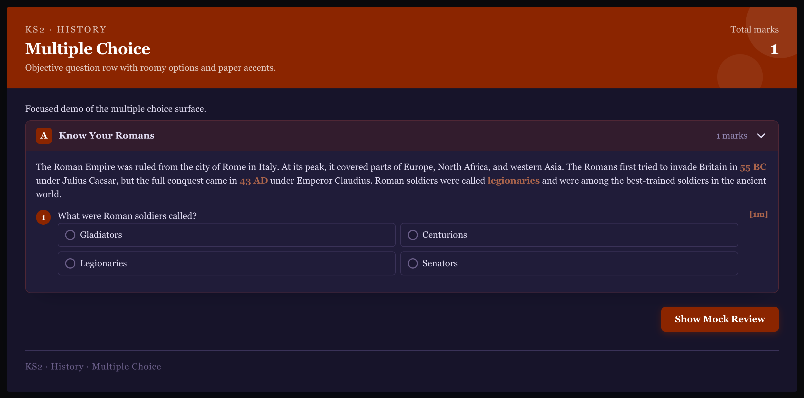
</p>

### Lines / extended response

Rendered by [`Sheet`](src/lib/Sheet.svelte), question layout in [`src/lib/components/sheet/paper-sheet.svelte`](src/lib/components/sheet/paper-sheet.svelte)

Description: Freeform longer-answer row for explanations, justifications, and worked reasoning.

Required inputs

- `question.id`
- `question.type = "lines"`
- `question.marks`
- `question.prompt`
- `question.lines`

Optional inputs

- `question.renderMode`

Answer payload: `answers[question.id] = string`

<p>
  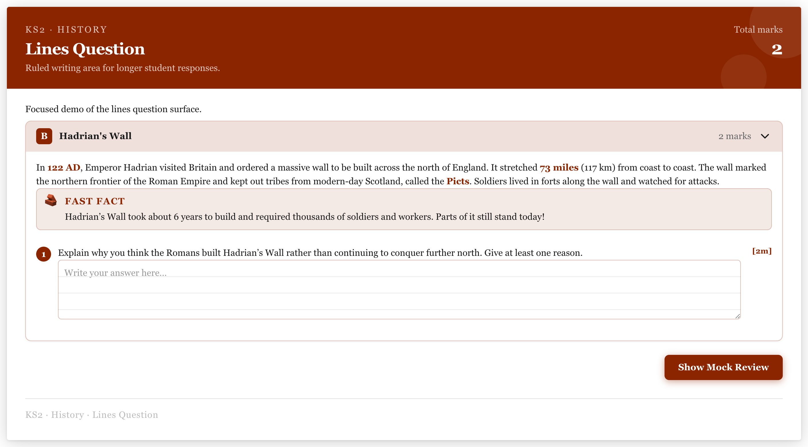
</p>
<p>
  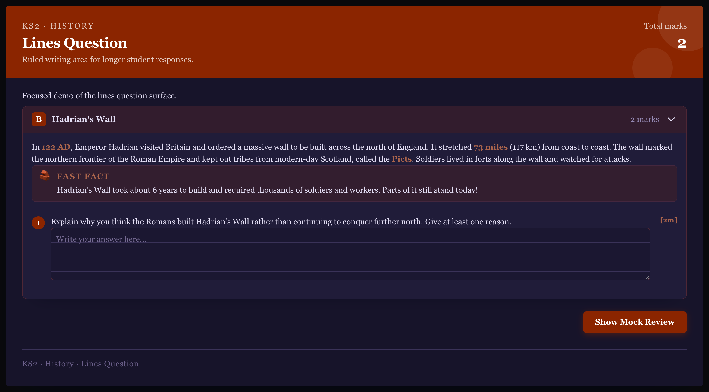
</p>

### Calculation row

Rendered by [`Sheet`](src/lib/Sheet.svelte), question layout in [`src/lib/components/sheet/paper-sheet.svelte`](src/lib/components/sheet/paper-sheet.svelte)

Description: Compact numeric or symbolic answer row with a left label and a right-side unit.

Required inputs

- `question.id`
- `question.type = "calc"`
- `question.marks`
- `question.prompt`
- `question.inputLabel`
- `question.unit`

Optional inputs

- `question.hint`

Answer payload: `answers[question.id] = string`

<p>
  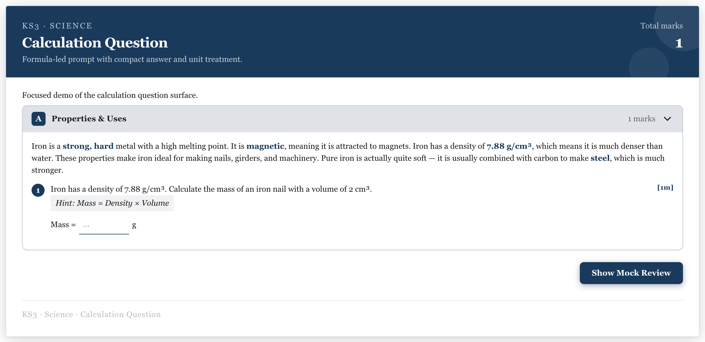
</p>
<p>
  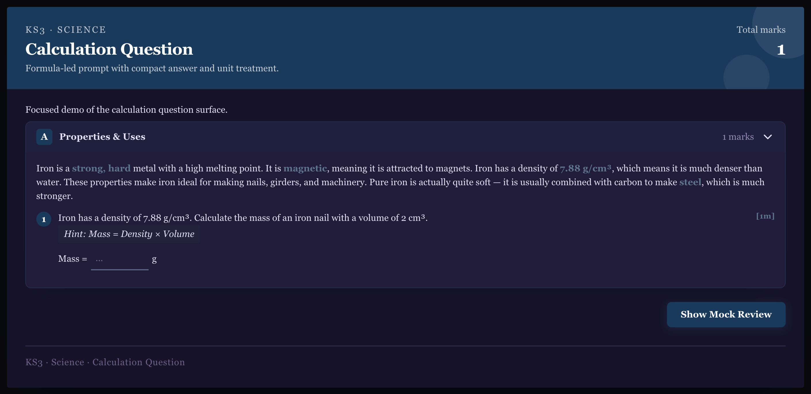
</p>

### Match pairs

Rendered by [`Sheet`](src/lib/Sheet.svelte), question layout in [`src/lib/components/sheet/paper-sheet.svelte`](src/lib/components/sheet/paper-sheet.svelte)

Description: Two-column matching interaction where the student connects each term to its paired meaning.

Required inputs

- `question.id`
- `question.type = "match"`
- `question.marks`
- `question.prompt`
- `question.pairs[]`

Optional inputs

- none

Answer payload: `answers[question.id] = Record<string, string>`

<p>
  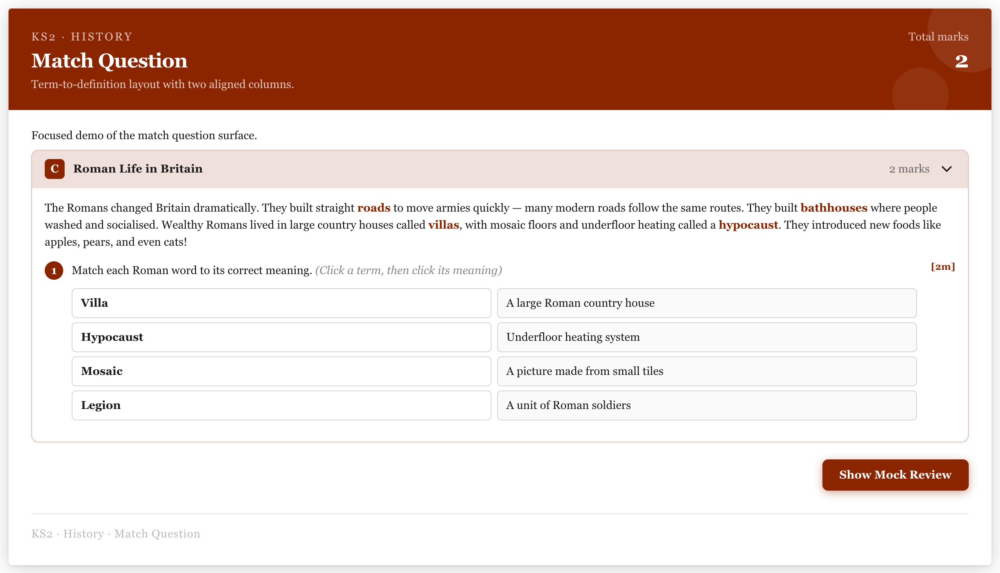
</p>
<p>
  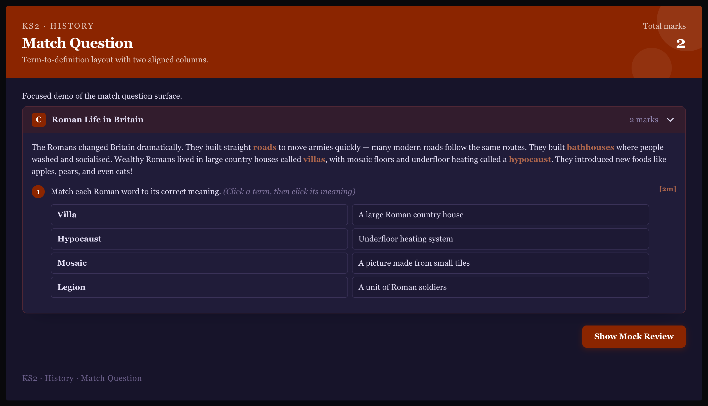
</p>

### Spelling correction

Rendered by [`Sheet`](src/lib/Sheet.svelte), question layout in [`src/lib/components/sheet/paper-sheet.svelte`](src/lib/components/sheet/paper-sheet.svelte)

Description: Correction list that presents a misspelled word and captures the repaired spelling inline.

Required inputs

- `question.id`
- `question.type = "spelling"`
- `question.marks`
- `question.prompt`
- `question.words[]`

Optional inputs

- none

Answer payload: `answers[question.id] = Record<string, string>`

<p>
  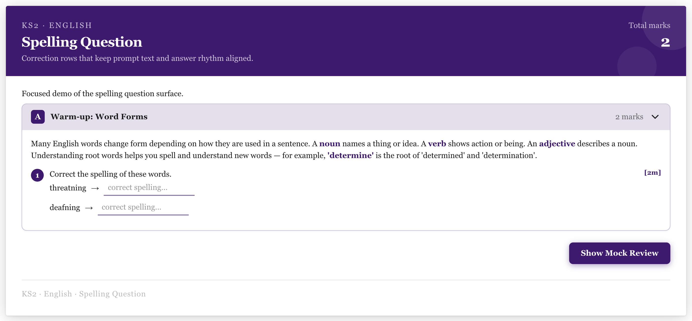
</p>
<p>
  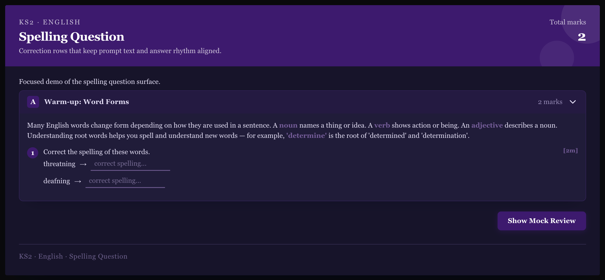
</p>

## Public API

```ts
import {
	Markdown,
	Sheet,
	SheetFeedbackCard,
	SheetFeedbackThread,
	SheetAnswersSchema,
	SheetDocumentSchema,
	SheetFeedbackAttachmentSchema,
	SheetFeedbackThreadSchema,
	SheetFeedbackTurnSchema,
	SheetReferencesSchema,
	SheetReportSchema,
	SheetReviewSchema,
	sampleSheets,
	type SheetAnswers,
	type SheetDocument,
	type SheetFeedbackState,
	type SheetFeedbackStateMap,
	type SheetFeedbackThreadData,
	type SheetMode,
	type SheetQuestion,
	type SheetQuestionReview,
	type SheetReplyPayload,
	type SheetReview,
	type SheetSample
} from '@ljoukov/sheet';
```

`Sheet` accepts a `document` plus optional `answers`, `seedAnswers`, `review`, `mockReview`, `feedbackThreads`, `feedbackState`, `mode`, `allowReplies`, `showFooter`, `footerLabel`, `onAnswersChange`, and `onReply`.
