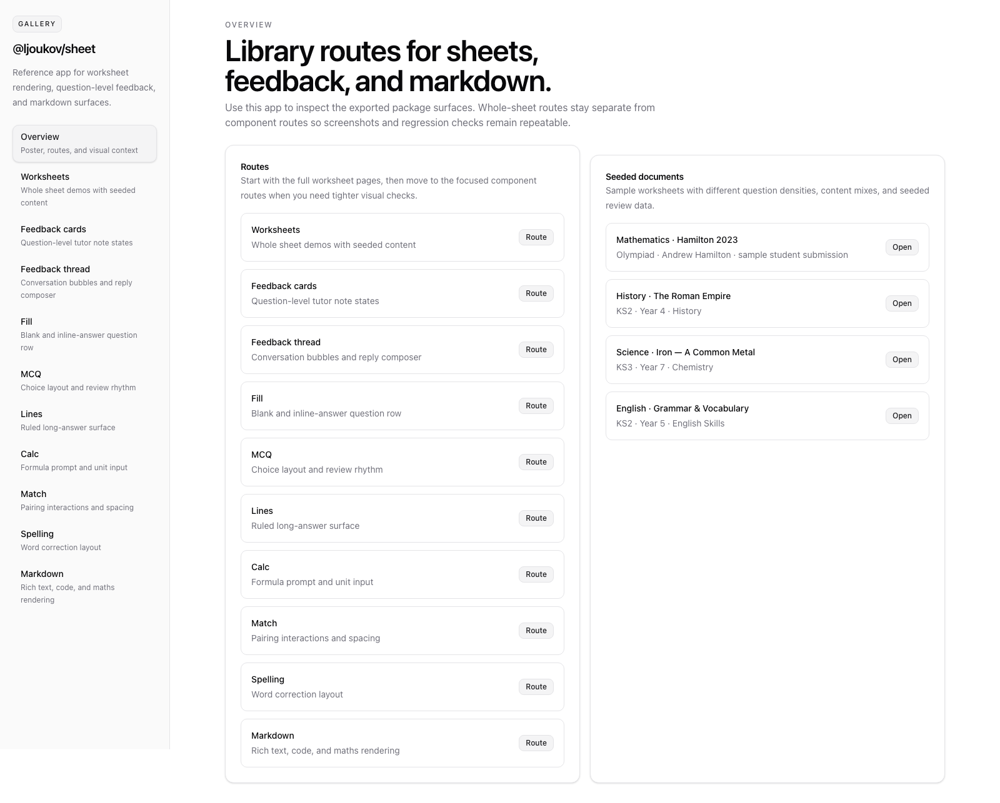
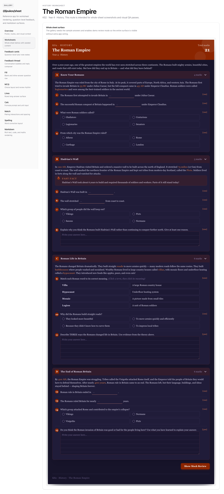
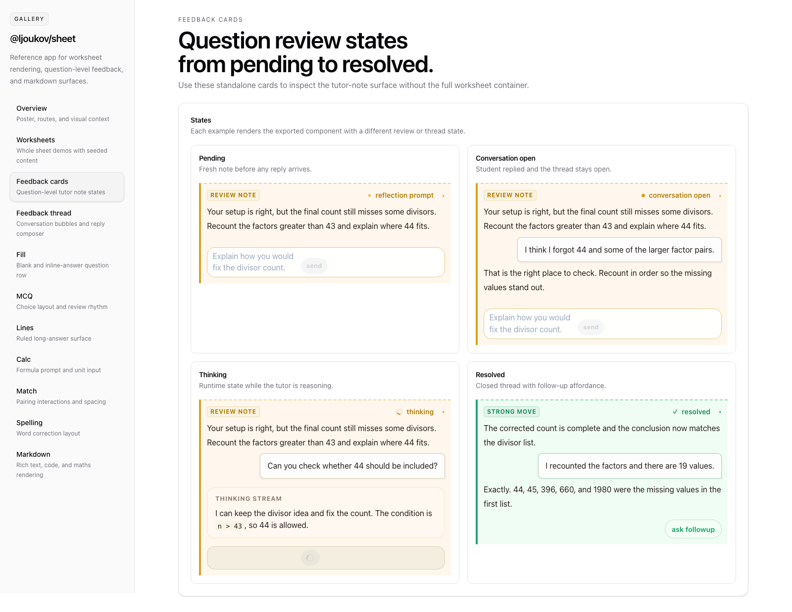
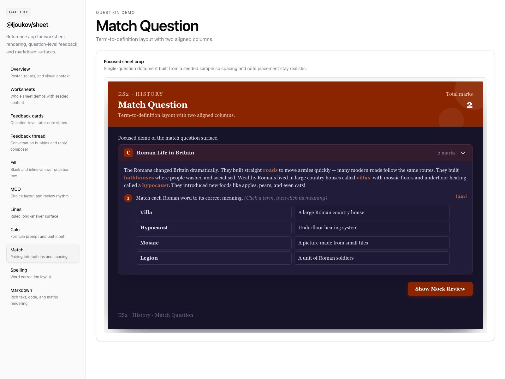

# `@ljoukov/sheet`

Paper-first Svelte components for rendering printable-style worksheets, reviewed answer sheets, rich tutor feedback cards, and reply threads.

The package is built for Svelte 5 component-library usage and ships with a SvelteKit gallery app under [`examples/gallery`](examples/gallery) for visual review and screenshot capture.

## What It Includes

- `Sheet`: full worksheet renderer with interactive, readonly, review, and demo modes
- `SheetFeedbackCard`: question-level review note with optional reply flow
- `SheetFeedbackThread`: standalone tutor thread and composer surface
- `Markdown`: shared markdown renderer with KaTeX maths and syntax highlighting
- typed schemas, exported types, and seeded sample documents for local demos

## Install

```sh
npm install @ljoukov/sheet
```

Import the package stylesheet once so KaTeX and shared utility styles are available:

```svelte
<script lang="ts">
	import '@ljoukov/sheet/styles.css';
</script>
```

## Quick Start

```svelte
<script lang="ts">
	import '@ljoukov/sheet/styles.css';
	import { Sheet, sampleSheets, type SheetAnswers } from '@ljoukov/sheet';

	const sample = sampleSheets[0];
	let answers: SheetAnswers = sample.seedAnswers ?? {};
</script>

<Sheet document={sample.document} mode="demo" mockReview={sample.mockReview} bind:answers />
```

For live tutoring flows, pass `review`, `feedbackThreads`, `feedbackState`, and `onReply` into `Sheet`, or use `SheetFeedbackCard` and `SheetFeedbackThread` directly when you need those surfaces outside the full worksheet layout.

## Gallery

The repo includes a SvelteKit gallery app for full-sheet routes and isolated component demos.

The gallery shell follows a Tailwind v4 and `shadcn-svelte`-style setup with a local [`components.json`](examples/gallery/components.json) so future demo surfaces can adopt the same conventions.

```sh
npm install
npm run gallery:dev
```

Useful routes:

- `/worksheet/roman`
- `/worksheet/iron`
- `/feedback`
- `/thread`
- `/markdown`
- `/questions/fill`
- `/questions/mcq`
- `/questions/lines`
- `/questions/calc`
- `/questions/match`
- `/questions/spelling`

## Screenshots

Overview



Whole worksheet



Feedback cards



Question demo



## Development

```sh
npm run check
npm test
npm run build
npm run gallery:check
npm run gallery:build
```

`npm run verify` runs the full library and gallery validation pass used by CI.

## Public API

```ts
import {
	Markdown,
	Sheet,
	SheetFeedbackCard,
	SheetFeedbackThread,
	SheetAnswersSchema,
	SheetDocumentSchema,
	SheetFeedbackAttachmentSchema,
	SheetFeedbackThreadSchema,
	SheetFeedbackTurnSchema,
	SheetReferencesSchema,
	SheetReportSchema,
	SheetReviewSchema,
	sampleSheets,
	type SheetAnswers,
	type SheetDocument,
	type SheetFeedbackState,
	type SheetFeedbackStateMap,
	type SheetFeedbackThreadData,
	type SheetMode,
	type SheetQuestion,
	type SheetQuestionReview,
	type SheetReplyPayload,
	type SheetReview,
	type SheetSample
} from '@ljoukov/sheet';
```

`Sheet` accepts a `document` plus optional `answers`, `seedAnswers`, `review`, `mockReview`, `feedbackThreads`, `feedbackState`, `mode`, `allowReplies`, `showFooter`, `footerLabel`, `onAnswersChange`, and `onReply`.

## Releasing

This package publishes through GitHub Actions using npm trusted publishing.

1. Update `package.json` version.
2. Run `npm run verify`.
3. Commit and push to `main`.
4. Create and push a matching tag such as `v0.1.0`.

```sh
git tag v0.1.0
git push origin main --tags
```

The publish workflow validates that the tag matches `package.json` before running `npm publish`.
